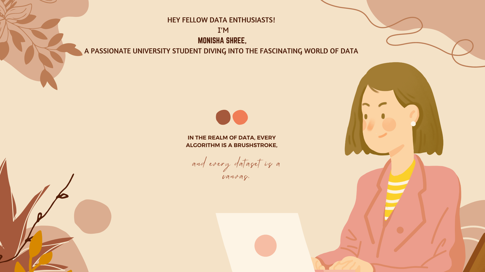

 
 
👋 Hello, fellow data enthusiasts! I'm [Your Name], a Computer Science master's student with a passion for unraveling insights from data. 🌟 Aspiring Data Scientist and Machine Learning Engineer, I'm on an exciting journey to blend theory with real-world applications.

🔍 What I'm Up To:
📚 Currently diving deep into Machine Learning and Natural Language Processing (NLP).
💻 Building a foundation in data-driven decision making through coursework and personal projects.
🌱 Learning new algorithms and techniques to extract meaningful patterns from complex datasets.

## 💬 **Let's Connect and Learn Together**

 Monisha Shree

Open to collaboration and new opportunities!