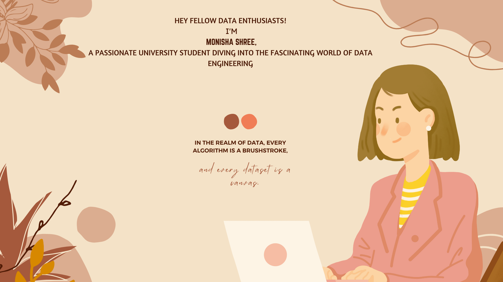

#🚀**Data Engineer**

 
 

## 🎓 **Current Academic Arsenal**

- **Major**: Computer Science
- **Courses**: Big Data, Algorithms, Data Structures
- **Self-Study**: Data Engineering Concepts, ETL Processes

## 🛠️ **Tools I'm Crafting With**

-**Languages**: Python, Data Structures and Algorithms, SQL
-**ETL Tools**: Azure Data Lake Storage, Azure Data Factory, Amazon S3, Azure Databricks, PySpark, Snowflake, Kafka, Airflow
-**CI/CD Tools**: Git bash, Bitbucket, Jira, TeamCity, IBM UrbanCode Deploy, Autosys
-**Data manipulation**: Pandas, NumPy
-**Data visualization**: Seaborn, Matplotlib
-**Machine learning framework**: ScikitLearn

## 🤝 **Let's Connect and Learn Together**

-[ Monisha Shree](https://www.linkedin.com/in/monisha-shree-6b8663156/)
&nbsp;
